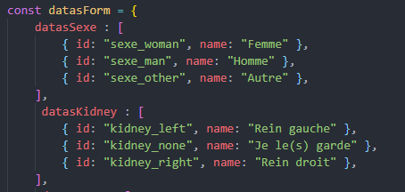

# Introduction

Ce projet a été réalisé pour le défi du discord Le Designer du Web.

Je suis partie sur l'idée de faire un formulaire de don d'organes et de sang. Le tout était d'apporter une petite touche d'humour (noir ?) dans ce projet. Les utilisateurs remplissent un formulaire et sont renvoyés vers une page résumé.

# Eléments mis en place

## Librairies et Frameworks

Pour faire ce projet, j'ai utilisé MDB 5 React, qui est un kit ui combinant Bootstrap 5 et Material Design 2.0. Très utile pour faire les label flottant des inputs.

Je n'utilise pas Redux et son store. Cela m'aurait probablement simplifié la tache, mais n'ayant pas encore pratiqué en solo ne serait-ce qu'un projet Réact, et n'ayant que 2 jours pour mener à bien ce défi, j'ai pris la décision de pas l'utiliser.

## App

L'application comporte un header et un footer sans rien de particulier. Le but du défi étant le formulaire, je n'ai rien fait de complexe. Un menu de navigation n'aurait pas eu grand intérêt.

Ceci implique que pour partager mes données dans toute l'application, j'ai dû transmettre les props d'un composant à un autre.

## Page Home

Première page très simple, un texte, une image et un bouton pour envoyer l'utilisateur vers le formulaire.

## Page formulaire

Cette page est bien entendu le corps du projet. Elle se sépare en 2 parties, les coordonnées de l'utilisateur et les informations pour le don à venir.

### Différents sortes d'input utilisés

Je n'ai utilisé que 2 sortes d'input. Des boutons radio pour toutes les questions à choix unique et des input text pour tous les autres quetions.

Ces champs utilisent chacun leur composant ce qui permet de les utiliser plus facilement dans le projet.

#### Données transmises au composant ``Input`` :

`value` gère le state du bouton afin de récupérer sa valeur et lui appliquer facilement.

`label` gère le message affiché en gris sous le champ.

`setFormValues & formValues` gère la mise à jour des données.

`error` contient le message d'erreur à afficher.

`setErrors & errors` gère la mise à jour des erreurs.

#### Données transmises au composant ``GroupRadio`` :

Un ``GroupRadio`` regroupe un ensemble de composants ``Radio``. Les données de ces groupes sont stockés dans un fichier js regroupant toutes ces données.

Les données sont stockées ainsi : 

`values` envoie les données des ``Radio``.

`defaultChecked` permet de choisir une valeur par défaut. Celle-ci était initialisé via le state de formValues.

`labelClass` afin de pouvoir afficher un stype différent en fonction du groupe de boutons.

`setFormValues & formValues` gère la mise à jour des données.

`error` contient le message d'erreur à afficher.

`setErrors & errors` gère la mise à jour des erreurs.

### Gestion des erreurs

Si l'utilisateur valide le formulaire sans avoir rempli l'ensemble des champs obligatoires. De plus, il y a aussi une vérification sur le format des données.

Dès le moment où l'utilisateur modifie le champ, le message d'erreur disparait, comme le montre l'image suivante :

### Formatage du téléphone

Le numéro de téléphone se formate automatiquement à la saisie de l'utilisateur afin d'ajouter des espaces tous les 2 chiffres ou retirer les espaces en trop.

### Barre de progression de remplissage

A chaque saisie de l'utilisateur dans le formulaire, la barre de progression sous le titre se met à jour afin d'informer l'utilisateur de l'avancement. Une fois celle-ci complètement verte, l'utilisateur sait que cette partie est valide pour passer à l'étape suivante.

Le même principe a été mis en place pour les informations du code. Toutefois, il suffit d'un choix accepté pour que le formulaire soit valide. Si l'utilisateur remplit le formulaire de don, c'est bien pour faire au moins une donation :)

## Page résumé

Cette page affiche le résumé des données que l'utilisateur a saisie.

### Génération d'une date automatique

Afin de compléter la donation, je me devais de fixer une date de rendez-vous afin de récupérer ce que l'utilisateur souhaite donner.

Une date est donc planifiée dans les 14 jours, entre 8h et 19h.

# Améliorations possibles

## Redux

Tout d'abord, bien entendu, Redux. Cela m'aurait éviter de devoir transmettre les props dès que j'en avais besoin. Je pensais pas en avoir autant à la base. Au début du projet, chaque champ du formulaire était géré individuellement, ce qui rendait la gestion des props bien plus hardue. Une fois tout mis dans un objet, cela a déjà bien simplifié leur utilisation.

## Affichage des erreurs de formatage à la saisie

Indiquer à l'utilisateur dès la première saisie d'un caractère non authorisé aurait été un plus. Le temps me manquait pour mettre cela en place. A voir par la suite pour le faire.

## Thème

J'aurais probablement pu adapter un peu mieux les couleurs, voir ajouter des icones ou images. 

# Conclusion

Ce projet était mon premier projet Réact fait par moi-même de A à Z. J'ai finalement très peu utilisé MDB.

Je suis content d'avoir réussi à faire un premier projet en solo. Ce n'est que le premier d'une longue série !